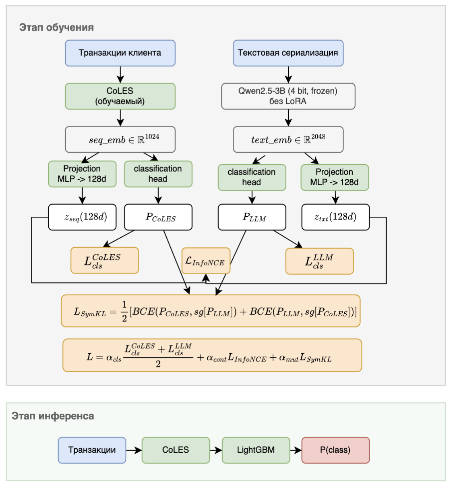

# Bidirectional Knowledge Distillation between LLM and Sequence Models for Event Sequences

[](https://www.python.org/downloads/)
[](https://pytorch.org/)
[](https://lightning.ai/)
[](https://github.com/dllllb/pytorch-lifestream)
[](https://huggingface.co/pytorch-lifestream)

This project explores knowledge transfer between LLMs (large language models) and specialized models for structured (transactional) data. LLMs can reason over serialized event logs and generate rich explanations, but are slow and costly at inference. Structured models are efficient and accurate, but lack interpretive depth.

We study two directions of knowledge transfer: distilling LLM outputs (pseudo-labels, rationales) into structured models, and enriching LLM prompts with embeddings and statistics from structured models as chain-of-thought context.

<p align="center">
  
</p>

We assume the general research questions:

**RQ1:** Does bidirectional knowledge transfer between LLMs and structured models improve transaction classification performance compared to either approach alone?

**RQ2:** Which teacher signal and transfer method works best in each direction?

**RQ3:** How do LLM size and CoT reasoning ability affect transfer quality in both directions?

## Datasets


| Dataset | Task                | Metric   | Clients | Transactions |
| ------- | ------------------- | -------- | ------- | ------------ |
| Gender  | Binary (gender)     | ROC-AUC  | 8 400   | 6.85M        |
| Rosbank | Binary (churn)      | ROC-AUC  | 5 000   | 1.0M         |
| Age     | 4-class (age group) | Accuracy | 30 000  | 27M          |


## Quick Start

Experiments were run on RTX 3090 24GB

```bash
pip install -e .

# Pre-download all three datasets
bash scripts/download_data.sh
```

The bidirectional method uses checkpoints from earlier stages, so the four stages must be run in order.

```bash
# CoLES baseline
python experiments/rq1_bidirectional/coles/run_gender_coles.py
python experiments/rq1_bidirectional/coles/run_rosbank_coles.py
python experiments/rq1_bidirectional/coles/run_age_coles.py

# LLM4ES
python experiments/rq2_d1_teacher_signals/feature_based/gender_llm4es.py
python experiments/rq2_d1_teacher_signals/feature_based/rosbank_llm4es.py
python experiments/rq2_d1_teacher_signals/feature_based/age_llm4es.py

# LATTE
python experiments/rq1_bidirectional/latte/gender_latte.py
python experiments/rq1_bidirectional/latte/rosbank_latte.py
python experiments/rq1_bidirectional/latte/age_latte.py

# Bidirectional LATTE + Symmetric KL without LoRA (winning config from Table 3.7)
python experiments/rq1_bidirectional/latte_symmetric_kl/gender_symmetric_kl_without_lora.py
python experiments/rq1_bidirectional/latte_symmetric_kl/rosbank_symmetric_kl_without_lora.py
python experiments/rq1_bidirectional/latte_symmetric_kl/age_symmetric_kl_without_lora.py
```

## Main results

Comparison of knowledge transfer directions (Table 3.7)


| Method                              | Direction      | Gender     | Rosbank    | Age        |
| ----------------------------------- | -------------- | ---------- | ---------- | ---------- |
| CoLES baseline                      | Unidirectional | 0.8626     | 0.8054     | 0.6345     |
| LATTE                               | Unidirectional | 0.8674     | 0.8057     | **0.6429** |
| LATTE + Symmetric KL (with LoRA)    | Bidirectional  | 0.8713     | 0.8122     | 0.6313     |
| LATTE + Symmetric KL (without LoRA) | Bidirectional  | **0.8774** | **0.8192** | 0.6397     |


## Unidirectional experiments

All prompt-enrichment and LLM-size experiments require an OpenRouter API key

```bash
export OPENROUTER_API_KEY=sk-or-...
```

### Teacher signal types


| Signal         | Gender     | Rosbank   | Age        |
| -------------- | ---------- | --------- | ---------- |
| Response-based | 0.8633     | 0.8074    | 0.6399     |
| Feature-based  | 0.864      | **0.819** | 0.6400     |
| Relation-based | **0.8674** | 0.8057    | **0.6429** |


Example 

```bash
python experiments/rq2_d1_teacher_signals/response_based/gender_reverse_kl.py
python experiments/rq2_d1_teacher_signals/response_based/rosbank_reverse_kl.py
python experiments/rq2_d1_teacher_signals/response_based/age_reverse_kl.py

```

### Prompt enrichment

Qwen2.5-7B-Instruct as the LLM, results show ROC-AUC for Gender/Rosbank and accuracy for Age.


| Enrichment         | Source  | Gender    | Rosbank   | Age       |
| ------------------ | ------- | --------- | --------- | --------- |
| None               | —       | 0.498     | 0.499     | 0.2380    |
| Prediction         | XGBoost | 0.508     | 0.547     | 0.2780    |
| Explanation (SHAP) | XGBoost | 0.606     | 0.637     | 0.3976    |
| Retrieval (kNN)    | CoLES   | **0.762** | **0.766** | **0.543** |


Example 

```bash
python experiments/rq2_d2_prompt_enrichment/by_enrichment_type/no_enrich.py
python experiments/rq2_d2_prompt_enrichment/by_enrichment_type/prediction_enrich.py
python experiments/rq2_d2_prompt_enrichment/by_enrichment_type/prediction_enrich_age.py
python experiments/rq2_d2_prompt_enrichment/by_enrichment_type/gender_rosbank_cot_enrichments.py
python experiments/rq2_d2_prompt_enrichment/by_enrichment_type/age_cot_enrichments.py
```

### LLM size and architecture family

Effect of LLM size on the +kNN enrichment, Gender:


| LLM                    | Size       | None      | + kNN     |
| ---------------------- | ---------- | --------- | --------- |
| Gemma 3-4B             | 4B (dense) | **0.528** | 0.767     |
| Qwen2.5-7B             | 7B (dense) | 0.498     | 0.762     |
| Qwen3.6-35B-A3B        | 35B (MoE)  | 0.508     | **0.779** |
| DeepSeek-V3.2-Speciale | 671B (MoE) | 0.515     | 0.783     |


Example 

```bash
python experiments/rq3_llm_size_effect/d2_size_for_enrichment/gemma_3_4b/gender_gemma.py
python experiments/rq3_llm_size_effect/d2_size_for_enrichment/qwen_25_7b/gender_qwen7b.py
python experiments/rq3_llm_size_effect/d2_size_for_enrichment/qwen_25_7b/rosbank_qwen7b.py
python experiments/rq3_llm_size_effect/d2_size_for_enrichment/qwen_25_7b/age_qwen7b.py
python experiments/rq3_llm_size_effect/d2_size_for_enrichment/qwen_36_35b/gender_qwen36.py
python experiments/rq3_llm_size_effect/d2_size_for_enrichment/deepseek_v32/gender_deepseek.py
```

### Prompting strategies

Strategy × enrichment matrix on Gender:


| Strategy  | None      | + SHAP    | + kNN     | + Both |
| --------- | --------- | --------- | --------- | ------ |
| Zero-shot | 0.498     | 0.542     | **0.770** | 0.616  |
| Few-shot  | **0.578** | 0.555     | 0.766     | 0.592  |
| CoT       | 0.491     | **0.606** | 0.762     | 0.745  |


Example 

```bash
python experiments/rq2_d2_prompt_enrichment/by_strategy/strategy_matrix.py
python experiments/rq2_d2_prompt_enrichment/by_strategy/cot_ablation.py
```

